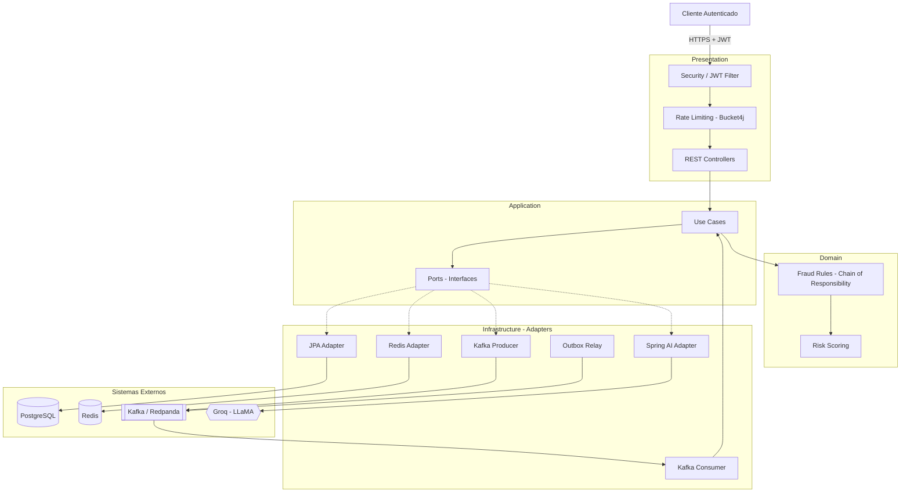

Cria o arquivo README.md na raiz do projeto (não dentro de docs).
IntelliJ: botão direito na raiz do projeto → New → File → README.md
Cola isso:
markdown# Fraud Sentinel

Sistema de detecção de fraudes financeiras em tempo real, construído com arquitetura
orientada a eventos, motor de regras determinístico e enriquecimento por IA assíncrona.

## Visão Geral

O Fraud Sentinel recebe transações financeiras, processa eventos via Kafka, aplica
regras de fraude configuráveis e calcula um score de risco em tempo real. A Inteligência
Artificial atua como camada de explicabilidade assíncrona — ela nunca toma a decisão
final (veja [ADR-0003](docs/adr/0003-ia-assincrona-explicabilidade.md)).

## Stack

- **Linguagem:** Java 21
- **Framework:** Spring Boot 4.0.6
- **Banco de dados:** PostgreSQL 16 + Flyway
- **Mensageria:** Apache Kafka (Redpanda local, Kafka real no CI)
- **Cache:** Redis
- **IA:** Spring AI 2.0 + Groq (LLaMA)
- **Mapeamento:** MapStruct 1.6.3
- **Segurança:** Spring Security 7 + JWT + Rate Limiting (Bucket4j)
- **Testes:** JUnit 5 + Mockito + Testcontainers
- **Observabilidade:** Micrometer + Prometheus + Grafana + Actuator
- **CI/CD:** GitHub Actions + Docker Compose

## Arquitetura

O projeto segue **Clean Architecture** com princípios hexagonais. O domínio não
depende de framework nem de infraestrutura — toda dependência externa passa por
interfaces (ports) e implementações (adapters).

A decisão em tempo real é feita pelo **rule engine** (Chain of Responsibility) +
**Redis**. A IA entra como enriquecimento assíncrono, fornecendo score consultivo
e justificativa. Se a IA ficar indisponível, o antifraude continua funcionando.
finalScore = (ruleScore × 0.70) + (aiScore × 0.30)

Pesos configuráveis via `application.yml`.

| Nível | Faixa |
|-------|-------|
| LOW | 0–25 |
| MEDIUM | 26–50 |
| HIGH | 51–75 |
| CRITICAL | 76–100 |

## Decisões Arquiteturais (ADRs)

| ADR | Decisão |
|-----|---------|
| [0001](docs/adr/0001-clean-architecture.md) | Clean Architecture com Ports & Adapters |
| [0002](docs/adr/0002-event-driven-kafka.md) | Arquitetura orientada a eventos com Kafka |
| [0003](docs/adr/0003-ia-assincrona-explicabilidade.md) | IA como camada assíncrona de explicabilidade |
| [0004](docs/adr/0004-redpanda-local-kafka-ci.md) | Redpanda no local, Apache Kafka no CI |
| [0005](docs/adr/0005-transactional-outbox.md) | Transactional Outbox como evolução deliberada |

## Documentação

- [Arquitetura e Diagramas](docs/architecture.md) — 6 diagramas Mermaid
- [Estrutura de Pacotes](docs/PACKAGE_STRUCTURE.md) — organização Clean Architecture

## Status

🚧 **Em construção** — o projeto está sendo desenvolvido em sprints incrementais.

## Autor

**Caio Silva** — [LinkedIn](https://linkedin.com/in/caiofldsilva) · [GitHub](https://github.com/CaioflSilva)