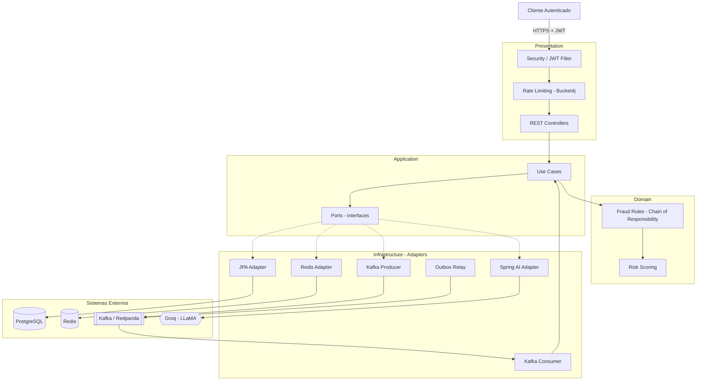

# Fraud Sentinel


Sistema de detecção de fraudes financeiras em tempo real, construído com arquitetura orientada a eventos, motor de regras determinístico e enriquecimento por IA assíncrona.

---

## Visão Geral

O Fraud Sentinel recebe transações financeiras, processa eventos via Kafka, aplica regras de fraude configuráveis e calcula um score de risco em tempo real. A Inteligência Artificial atua como camada de explicabilidade assíncrona — ela nunca toma a decisão final (veja [ADR-0003](docs/adr/0003-ia-assincrona-explicabilidade.md)).


```mermaid
graph TB
    U[Cliente Autenticado]
    subgraph PRESENTATION[Presentation]
        SEC[Security / JWT Filter]
        RL[Rate Limiting - Bucket4j]
        CTRL[REST Controllers]
    end
    subgraph APPLICATION[Application]
        UC[Use Cases]
        PORTS[Ports - Interfaces]
    end
    subgraph DOMAIN[Domain]
        RULES[Fraud Rules - Chain of Responsibility]
        SCORE[Risk Scoring]
    end
    subgraph INFRA[Infrastructure - Adapters]
        JPA[JPA Adapter]
        KP[Kafka Producer]
        KC[Kafka Consumer]
        RC[Redis Adapter]
        AIA[Spring AI Adapter]
        OBX[Outbox Relay]
    end
    subgraph EXTERNAL[Sistemas Externos]
        PG[(PostgreSQL)]
        RD[(Redis)]
        KAFKA[[Kafka / Redpanda]]
        GROQ{{Groq - LLaMA}}
    end
    U -->|HTTPS + JWT| SEC
    SEC --> RL
    RL --> CTRL
    CTRL --> UC
    UC --> PORTS
    UC --> RULES
    RULES --> SCORE
    PORTS -.-> JPA
    PORTS -.-> KP
    PORTS -.-> RC
    PORTS -.-> AIA
    JPA --> PG
    RC --> RD
    KP --> KAFKA
    KAFKA --> KC
    KC --> UC
    OBX --> KAFKA
    AIA --> GROQ
```

---

## Stack

| Camada | Tecnologia |
|---|---|
| Linguagem | Java 21 |
| Framework | Spring Boot 4.0.6 |
| Banco de dados | PostgreSQL 16 + Flyway |
| Mensageria | Apache Kafka (Redpanda local, Kafka no CI) |
| Cache | Redis |
| IA | Spring AI 2.0 + Groq (LLaMA) |
| Mapeamento | MapStruct 1.6.3 |
| Segurança | Spring Security 7 + JWT + Rate Limiting (Bucket4j) |
| Testes | JUnit 5 + Mockito + Testcontainers |
| Observabilidade | Micrometer + Prometheus + Grafana + Actuator |
| CI/CD | GitHub Actions + Docker Compose |

---

## Arquitetura

O projeto segue **Clean Architecture** com princípios hexagonais. O domínio não depende de framework nem de infraestrutura — toda dependência externa passa por interfaces (ports) e implementações (adapters).

A decisão em tempo real é feita pelo **rule engine** (Chain of Responsibility) + Redis. A IA entra como enriquecimento assíncrono, fornecendo score consultivo e justificativa. Se a IA ficar indisponível, o antifraude continua funcionando.
finalScore = (ruleScore × 0.70) + (aiScore × 0.30)

Pesos configuráveis via `application.yml`.

| Nível | Faixa |
|---|---|
| LOW | 0 – 25 |
| MEDIUM | 26 – 50 |
| HIGH | 51 – 75 |
| CRITICAL | 76 – 100 |

---

## Como Rodar

### Pré-requisitos

- Java 21+
- Docker e Docker Compose
- Maven 3.9+

### Subindo o ambiente

```bash
# Clone o repositório
git clone https://github.com/CaioflSilva/fraud-sentinel
cd fraud-sentinel

# Sobe os serviços externos (Kafka, Redis, PostgreSQL)
docker compose up -d

# Roda a aplicação
./mvnw spring-boot:run
```

### Acessando

| Serviço | URL |
|---|---|
| API REST | http://localhost:8080 |
| Swagger UI | http://localhost:8080/swagger-ui.html |
| Actuator | http://localhost:8080/actuator |
| Grafana | http://localhost:3000 |

### Rodando os testes

```bash
./mvnw test
```

---

## Decisões Arquiteturais (ADRs)

| ADR | Decisão |
|---|---|
| [0001](docs/adr/0001-clean-architecture.md) | Clean Architecture com Ports & Adapters |
| [0002](docs/adr/0002-event-driven-kafka.md) | Arquitetura orientada a eventos com Kafka |
| [0003](docs/adr/0003-ia-assincrona-explicabilidade.md) | IA como camada assíncrona de explicabilidade |
| [0004](docs/adr/0004-redpanda-local-kafka-ci.md) | Redpanda no local, Apache Kafka no CI |
| [0005](docs/adr/0005-transactional-outbox.md) | Transactional Outbox como evolução deliberada |

---

## Documentação

- [Arquitetura e Diagramas](docs/architecture.md) — 6 diagramas Mermaid
- [Estrutura de Pacotes](docs/PACKAGE_STRUCTURE.md) — organização Clean Architecture

---

## Status

🚧 **Em construção** — o projeto está sendo desenvolvido em sprints incrementais.

---

## Autor

**Caio Silva**

[](https://linkedin.com/in/caiofldsilva)
[](https://github.com/CaioflSilva)