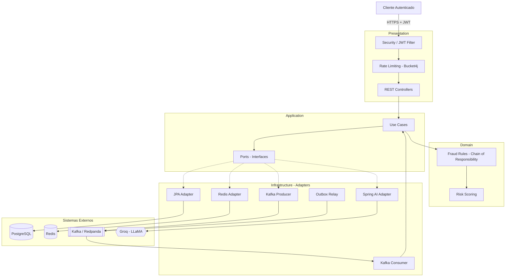
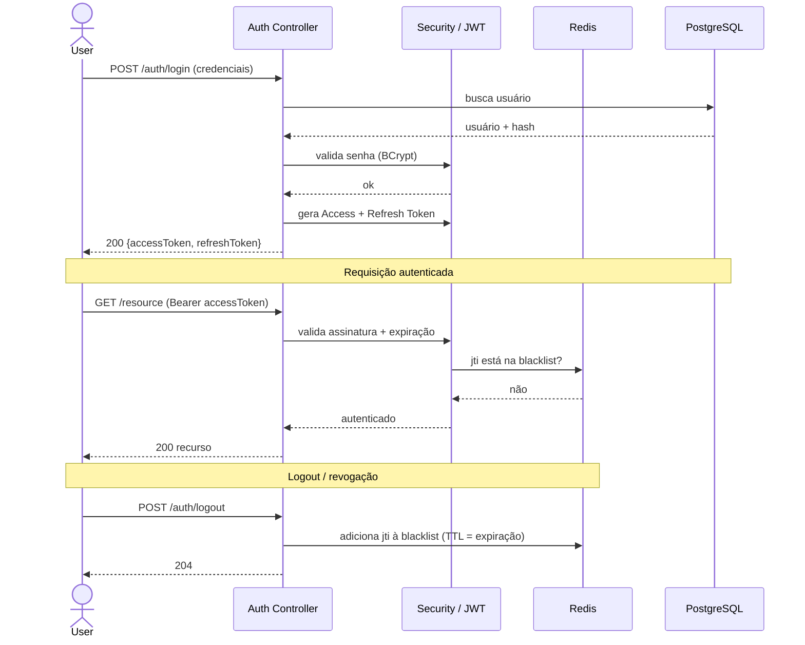
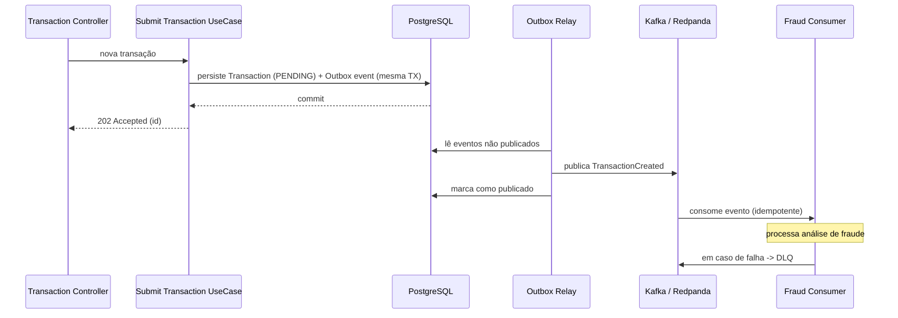
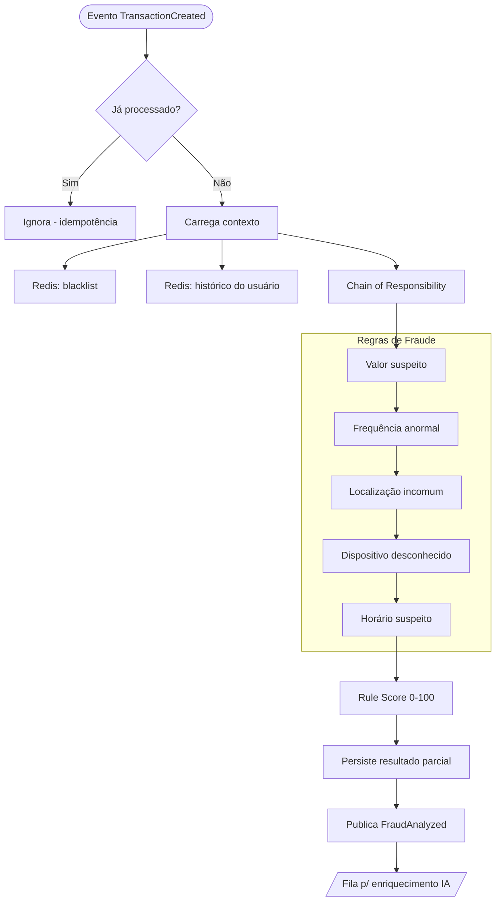
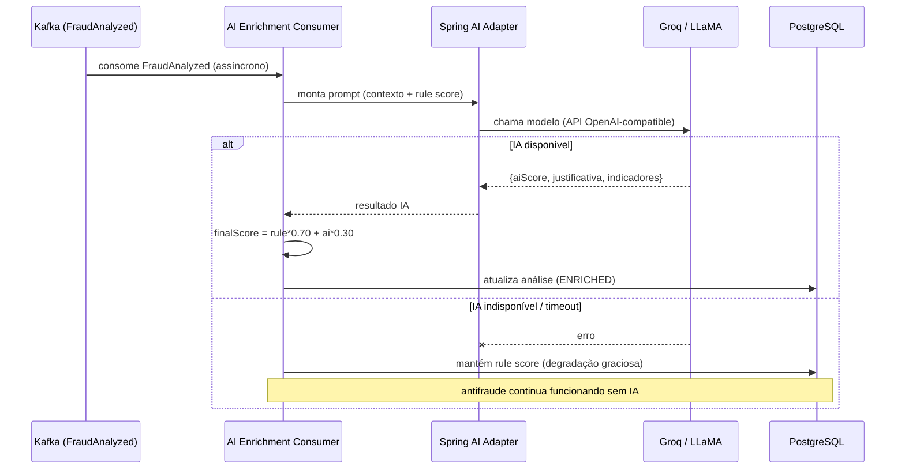
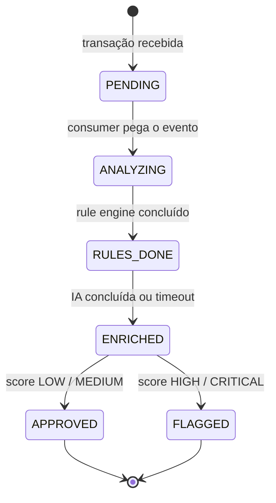
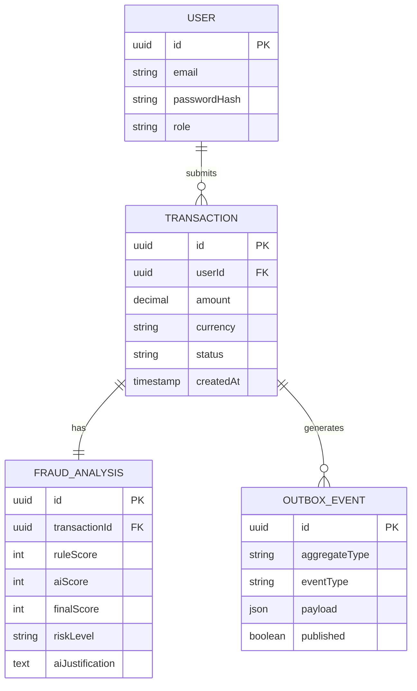

# Fraud Sentinel — Arquitetura

Sistema de detecção de fraudes financeiras em tempo real, orientado a eventos,
com análise por regras determinísticas e enriquecimento assíncrono por IA.

> **Princípio central:** a decisão em tempo real é feita pelo *rule engine* +
> Redis (rápido, determinístico, auditável). A IA **não decide** — ela enriquece
> a análise de forma assíncrona com um score consultivo e uma justificativa.
> Se a IA cair, o antifraude continua funcionando (degradação graciosa).

---

## 1. Arquitetura Geral

Camadas seguindo Clean Architecture + Ports & Adapters. O domínio não conhece
framework nem infraestrutura; toda dependência externa passa por interfaces.

---

## 2. Fluxo de Autenticação

JWT com Access + Refresh Token e blacklist em Redis (logout/revogação por `jti`).

---

## 3. Fluxo Kafka (ingestão + Outbox)

A transação é persistida e o evento é gravado na **mesma transação** (Outbox).
Um relay publica no Kafka depois — eliminando o problema de *dual-write*.

---

## 4. Fluxo de Análise de Fraude (Rule Engine)

As regras são elos de uma *Chain of Responsibility*. Cada uma soma ao score.
Tudo aqui é determinístico e rápido — sem chamada de IA no caminho.

---

## 5. Fluxo da IA (enriquecimento assíncrono)

A IA consome um segundo evento. Note o caminho de falha: se o Groq estiver
indisponível ou estourar timeout, o sistema mantém o rule score e segue.

---

## 6. Fluxo de Persistência

### Ciclo de vida da transação

### Modelo de dados (núcleo)

---

## Faixas de Score de Risco

| Nível | Faixa |
|-------|-------|
| LOW | 0–25 |
| MEDIUM | 26–50 |
| HIGH | 51–75 |
| CRITICAL | 76–100 |

`finalScore = (ruleScore × 0.70) + (aiScore × 0.30)` — pesos configuráveis via `application.yml`.